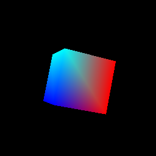

# GPUemu

### What is this project?

This started as a university project for the System Firmware (*Oprogramowanie Systemowe*) course, intended to emulate a simple PCI device in UEFI using QEMU. The scope eventually expanded to a full GPU emulation, covering everything from PCI communication to shader assembly code, VRAM management, and a graphics API. It is mainly used as a learning tool to understand how GPUs work from the ground up.

Currently, the GPU consists of a simple UEFI Driver, a shader assembler, and a few UEFI benchmark apps to demonstrate functionality.

This project could be extended in many ways, and the final product is not yet fully defined.

## Building

Since most of this project relies on modifying QEMU and EDK2 projects, we decided to avoid creating two different forks. Instead, we write our code as patches for both QEMU and EDK2 sources.

Here are the instructions:

-   Run `scripts/apply_patches.sh`
    -   This prepares submodules, applies patches to them, and symlinks directories to their respective submodules.

-   Run `scripts/build_all.sh`
    -   This builds both QEMU and EDK2. The default build type is `DEBUG`. You can use different build types by passing the name as a parameter (currently supports only `RELEASE`).

## Running

To run the UEFI Shell using our card, run `scripts/run.sh`.

This launches QEMU with our device as a video output and links the `Build` directory of EDK2 with our benchmark apps.

You can enter this directory from the UEFI shell by typing `FS0:` in the UEFI shell terminal.

## Documentation

Architectural specifications and choices are documented in `/docs`.

APIs, the Driver, and the GPU are documented via comments within the code itself.