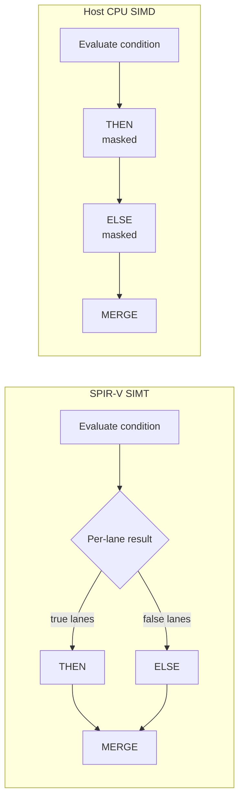
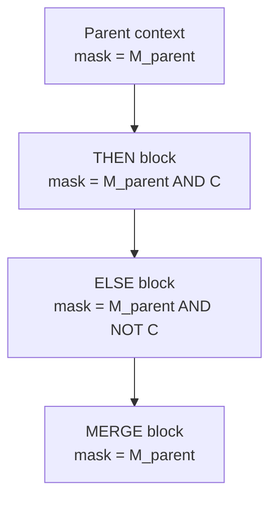
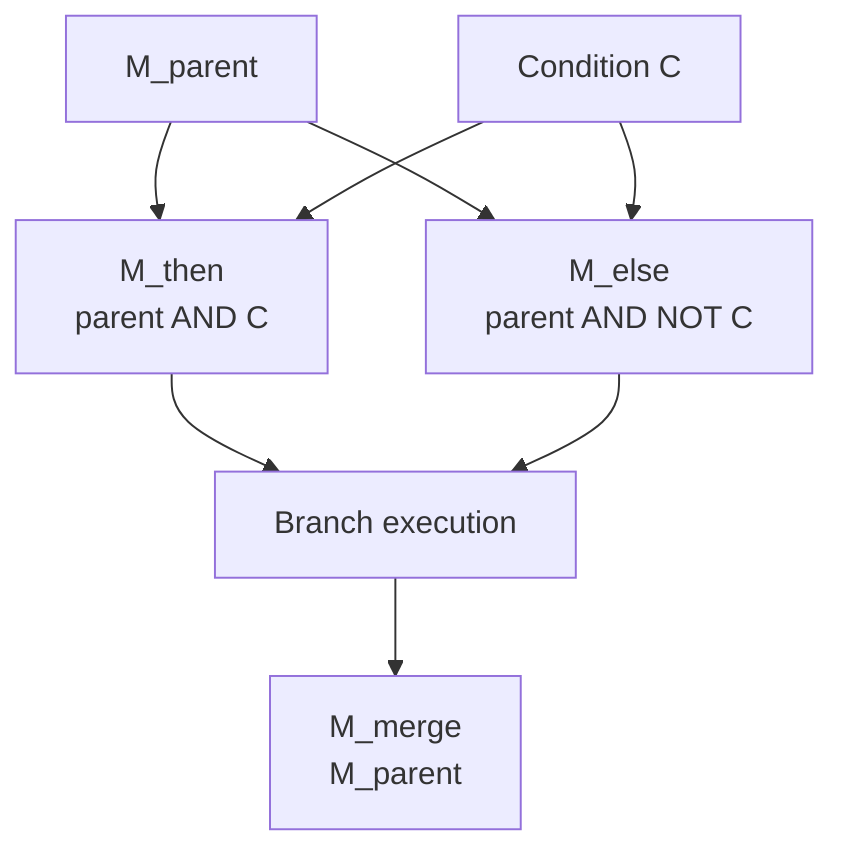
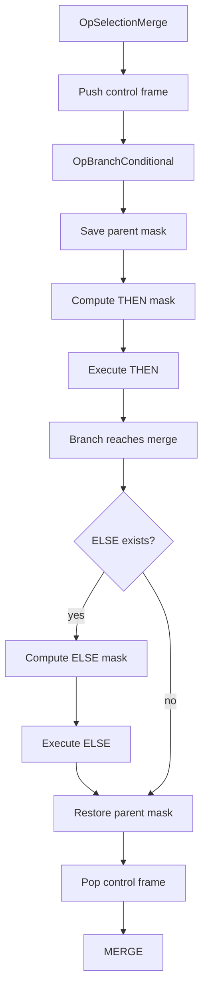
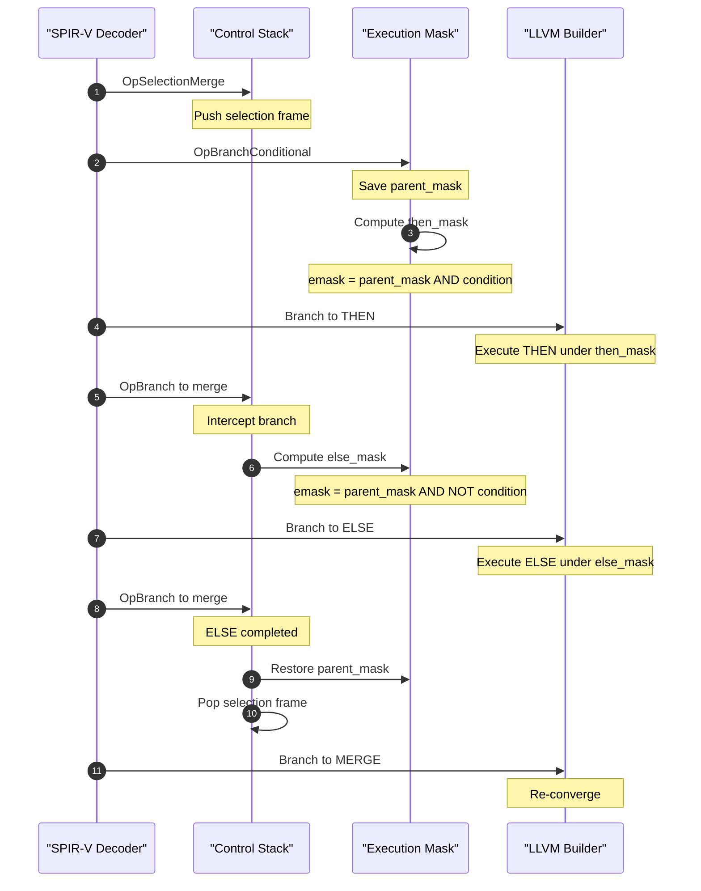
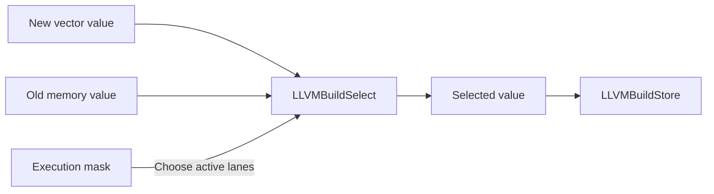
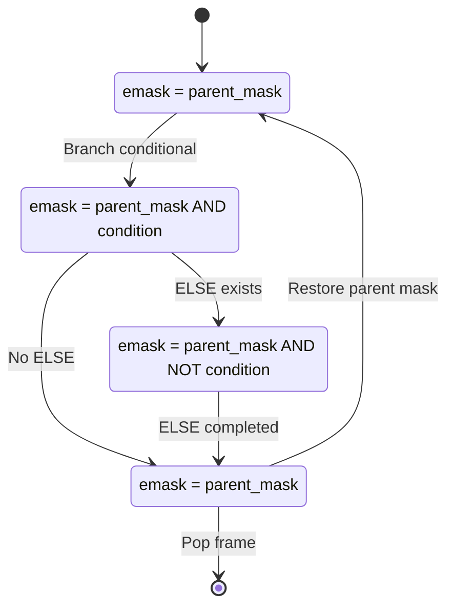
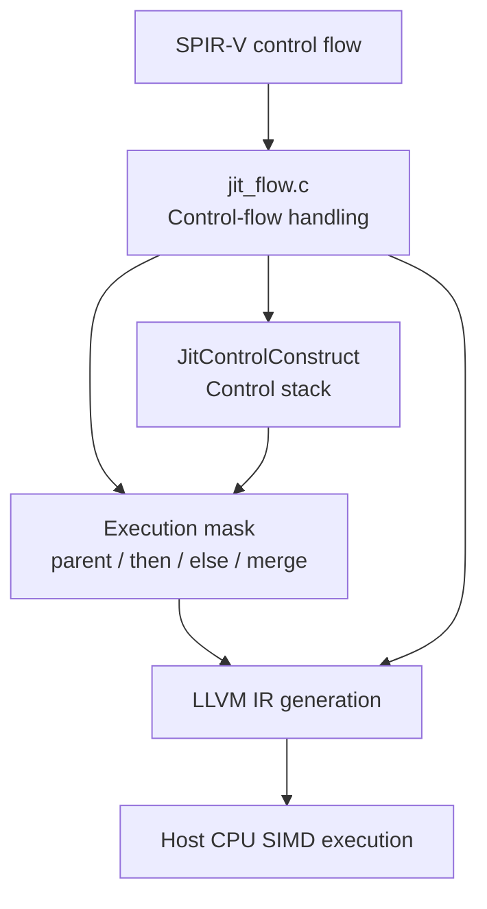

# Architectural Specification: SIMT Control Flow Linearization & Execution Masking

This document describes how `jit_flow.c` converts SPIR-V **Single Instruction, Multiple Threads (SIMT)** control flow into linearized vector code for execution on a host CPU using SIMD.

The main idea is simple:

> **Divergent control flow is executed sequentially, while an execution mask determines which vector lanes are allowed to change state.**

---

## 1. Overview

### 1.1 SIMD vs. SIMT

A CPU SIMD unit executes multiple lanes using a common control-flow path. SPIR-V, however, uses a SIMT model where each lane can logically follow a different path.

For example, an `OpBranchConditional` can produce:

* some lanes taking the `then` path;
* some lanes taking the `else` path.

This is called **lane divergence**.



The CPU therefore executes both paths sequentially instead of allowing individual lanes to branch independently.

---

## 2. Control-Flow Linearization

`jit_flow.c` uses **control-flow linearization** to handle divergent branches without converting every vector lane into a separate scalar execution stream.

For an `if`/`else` construct:

1. Execute the `then` block using the `then` mask.
2. Execute the `else` block using the `else` mask.
3. Restore the original mask at the merge block.



Here:

* `M_parent` is the mask before entering the branch.
* `C` is the vector condition.
* `M_then` selects lanes taking the `then` path.
* `M_else` selects lanes taking the `else` path.

---

## 3. Execution Masks

For a 16-lane vector:

$$
M_{\text{parent}} \in {0,1}^{16}
$$

and:

$$
C \in {0,1}^{16}
$$

The branch masks are:

$$
\begin{aligned}
M_{\text{then}} &= M_{\text{parent}} \wedge C \
M_{\text{else}} &= M_{\text{parent}} \wedge \neg C \
M_{\text{merge}} &= M_{\text{parent}}
\end{aligned}
$$

In simple terms:

```text
then = parent AND condition
else = parent AND NOT condition
merge = parent
```

### 3.1 Mask Properties

The masks must satisfy two important properties.

**Disjointness**

A lane cannot execute both branches:

$$
M_{\text{then}} \wedge M_{\text{else}} = 0
$$

**Completeness**

Every active parent lane executes one of the branches:

$$
M_{\text{then}} \vee M_{\text{else}} = M_{\text{parent}}
$$



---

## 4. Control-Flow Stack

`handle_op_branch_conditional()` and `handle_op_branch()` use a `JitControlConstruct` stack to track active control-flow constructs.

The stack supports nested selections and loops and is limited by:

```c
MAX_CONTROL_STACK = 64
```

A selection frame stores information such as:

* branch targets;
* merge target;
* branch condition;
* parent execution mask;
* whether the `then` path has already executed.

### 4.1 Selection Flow



### 4.2 Branch Interception

When the `then` block branches to `merge_id`, `handle_op_branch()` can intercept that branch.

If an `else` block exists:

1. Mark the `then` path as completed.

2. Calculate:

   $$
   M_{\text{else}} =
   M_{\text{parent}} \wedge \neg C
   $$

3. Set `ctx->emask` to the `else` mask.

4. Redirect execution to `false_id`.

5. After the `else` block completes, restore `M_parent`.

6. Pop the control frame.

7. Continue to the merge block.

This turns one divergent branch into two sequential masked regions.

---

## 5. Execution Sequence

The complete lifecycle can be summarized as follows:



### 5.1 Mask State

| Stage         | `emask`              | Meaning                            |
| ------------- | -------------------- | ---------------------------------- |
| Before branch | `M_parent`           | Active lanes from the parent scope |
| `then`        | `M_parent AND C`     | Lanes taking `then`                |
| `else`        | `M_parent AND NOT C` | Lanes taking `else`                |
| `merge`       | `M_parent`           | Original mask restored             |

---

## 6. Masked Memory Operations

Control-flow masking must also apply to memory operations.

A vector computation can produce a value for every lane even when some lanes are inactive. An inactive lane must not overwrite memory.

`jit_flow.c` obtains the current execution mask using:

```c
jit_get_emask(ctx)
```

The mask is then used with `LLVMBuildSelect` before storing the result.



The operation is equivalent to:

$$
\text{StoredValue}
==================

\operatorname{select}
(
\text{emask},
\text{NewValue},
\text{OldValue}
)
$$

For each lane:

$$
\text{Memory}[i] =
\begin{cases}
\text{NewValue}[i], & \text{if } \text{emask}[i] = 1 \
\text{OldValue}[i], & \text{if } \text{emask}[i] = 0
\end{cases}
$$

Therefore, inactive lanes keep their previous value.

### Example

```text
Lane:       0 1 2 3 4 5 6 7
Mask:       1 1 0 0 1 0 1 0

NewValue:   A B C D E F G H
OldValue:   a b c d e f g h

Result:     A B c d E f G h
```

---

## 7. `JitControlConstruct`

The control-flow stack contains `JitControlConstruct` frames.

| Field           | Type           | Purpose                            |
| --------------- | -------------- | ---------------------------------- |
| `kind`          | `JitCfgKind`   | Selection or loop                  |
| `merge_id`      | `uint32_t`     | Merge block ID                     |
| `true_id`       | `uint32_t`     | `then` block ID                    |
| `false_id`      | `uint32_t`     | `else` block ID                    |
| `executed_true` | `bool`         | Whether `then` has completed       |
| `cond`          | `LLVMValueRef` | Branch condition                   |
| `parent_mask`   | `LLVMValueRef` | Mask before entering the construct |
| `ctx->emask`    | `LLVMValueRef` | Current active execution mask      |

The state of a selection can be represented as:



---

## 8. Overall Architecture

The architecture has three main parts:

1. **Control-flow handling**
2. **Execution-mask management**
3. **LLVM vector code generation**



The key transformation is:

```text
SPIR-V SIMT
     |
     v
Divergent branch
     |
     v
Control-flow linearization
     |
     +----> THEN  : parent AND condition
     |
     +----> ELSE  : parent AND NOT condition
     |
     +----> MERGE : restore parent
     |
     v
Host CPU SIMD
```

---

## 9. Architectural Invariants

The implementation depends on several simple rules.

### 9.1 Mask Containment

A branch cannot activate a lane that was already inactive:

$$
M_{\text{then}} \subseteq M_{\text{parent}}
$$

$$
M_{\text{else}} \subseteq M_{\text{parent}}
$$

### 9.2 Branch Disjointness

The two branch masks cannot overlap:

$$
M_{\text{then}} \wedge M_{\text{else}} = 0
$$

### 9.3 Branch Completeness

Together, the two branch masks cover all active parent lanes:

$$
M_{\text{then}} \vee M_{\text{else}} = M_{\text{parent}}
$$

### 9.4 Mask Restoration

After the selection:

$$
M_{\text{merge}} = M_{\text{parent}}
$$

This prevents a nested branch from affecting its parent scope.

### 9.5 Memory Isolation

If:

$$
\text{emask}[i] = 0
$$

then lane `i` must not modify its corresponding memory state.

### 9.6 Vector Preservation

The implementation should keep vector operations vectorized. Individual lanes are not converted into separate scalar execution streams.

---

## 10. Performance

The main benefit is that vector computation remains vectorized.

The main cost is that divergent branches are executed sequentially:

$$
T_{\text{selection}}
\approx
T_{\text{then}}
+
T_{\text{else}}
+
T_{\text{overhead}}
$$

Therefore:

* uniform branches can be efficient;
* divergent branches execute both paths;
* masked stores preserve correct per-lane state;
* vector lanes are not scalarized.

The trade-off is therefore:

```text
SIMT semantics
      +
Vectorized CPU execution
      |
      v
Sequential divergent paths
      +
Execution masks
```

---

# 11. Summary

`jit_flow.c` converts divergent SPIR-V SIMT control flow into CPU-friendly SIMD execution using **control-flow linearization and execution masks**.

The process is:

1. Save the current execution mask.
2. Calculate the `then` mask.
3. Execute the `then` block.
4. Calculate the `else` mask.
5. Execute the `else` block.
6. Restore the original mask.
7. Continue at the merge block.

The two important masks are:

$$
M_{\text{then}} =
M_{\text{parent}} \wedge C
$$

$$
M_{\text{else}} =
M_{\text{parent}} \wedge \neg C
$$

Memory operations use the current mask so that inactive lanes retain their previous state.

In short:

> **Control flow is linearized; data execution remains vectorized; execution masks preserve SIMT lane semantics.**
