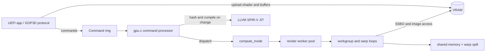
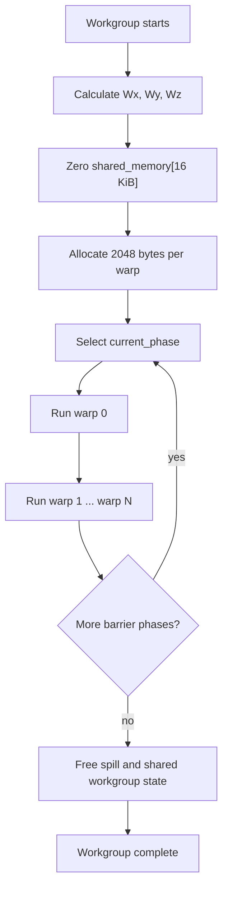
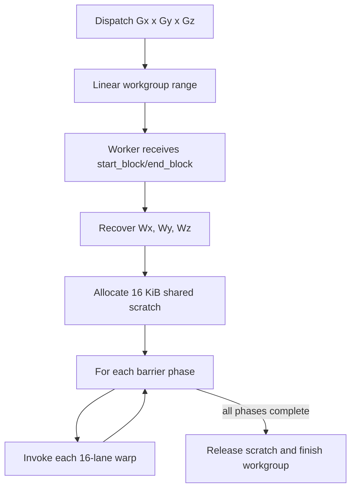
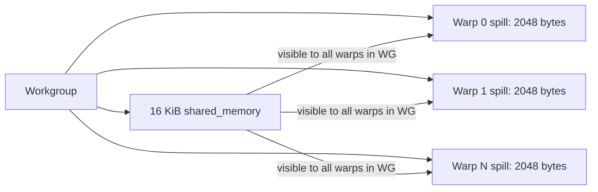
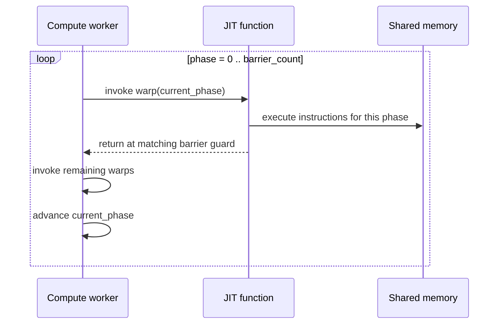

# Compute Shader Design

> Implementation reference for GPUemu compute dispatch.

## Contents

1. [Overview](#1-overview)
2. [Execution model](#2-execution-model)
3. [Command protocol](#3-command-protocol)
4. [JIT integration](#4-jit-integration)
5. [Memory model](#5-memory-model)
6. [Barriers](#6-barriers)
7. [Dispatch runtime](#7-dispatch-runtime)
8. [UEFI API](#8-uefi-api)
9. [Validation and remaining work](#9-validation-and-remaining-work)

## 1. Overview

Compute shaders run outside the graphics pipeline. They have no vertex input,
rasterization, or framebuffer output; instead, invocations read and write SSBOs
and images over a three-dimensional workgroup grid.

GPUemu executes compute shaders through the existing 16-lane SIMT JIT and the
render worker pool. The shader is compiled once from SPIR-V and then invoked
once per warp. Workgroups are independent, while warps in one workgroup share
scratch memory and are coordinated by barrier phases.



### Implemented components

| Component | Responsibility |
| --- | --- |
| `include/vram.h` | `CommandOpcode`, `StateID`, and packed payloads |
| `gpu/gpu.c` | `execute_command()`, shader hashing, state updates, dispatch setup |
| `gpu/jit/jit.c` | `jit_emit_instr()`, entry-point generation, local-size/barrier metadata |
| `gpu/jit/jit_mem.c` | `handle_op_variable()`, `resolve_pending_globals()`, loads/stores |
| `gpu/jit/jit_flow.c` | CFG masks, branch linearization, and phase guards |
| `gpu/renderer.c` | `compute_mode()` and `TASK_COMPUTE_SIMT` scheduling |
| `gpu/rasterizer_simt.c` | `worker_compute_simt_impl()` and built-in population |
| `UEFI/OptionRom/gop3d.c` | `GpuBindCompShader()`, `GpuBindSSBO()`, `GpuDispatchCompute()` |

## 2. Execution model

A dispatch describes a grid of workgroups. The shader declares the local size
with SPIR-V `OpExecutionMode LocalSize Sx Sy Sz`.

| Term | Meaning |
| --- | --- |
| Grid | `Gx * Gy * Gz` workgroups from a dispatch command |
| Workgroup | `Sx * Sy * Sz` invocations sharing scratch memory |
| Warp | 16 consecutive invocations executed as one SIMT call |
| Invocation | One logical shader invocation |

For workgroup `(Wx, Wy, Wz)` and local coordinate `(lx, ly, lz)`:

```text
LocalInvocationIndex = lz * Sx * Sy + ly * Sx + lx
LocalInvocationID    = (lx, ly, lz)
GlobalInvocationID   = (Wx * Sx + lx, Wy * Sy + ly, Wz * Sz + lz)
WorkGroupID          = (Wx, Wy, Wz)
NumWorkGroups        = (Gx, Gy, Gz)
WorkGroupSize        = (Sx, Sy, Sz)
```

The runtime schedules 16-lane warps and passes an active-lane bitmask through
`ExecutionContext.active_mask`. A final partial warp is therefore safe for
masked stores, atomics, image writes, and subgroup operations. Local sizes that
are multiples of 16 remain the best-tested configuration.

### Workgroup lifecycle

A workgroup is the unit that owns shared memory and participates in barrier
coordination. It is not the unit passed directly to the JIT: the runtime first
partitions the workgroup into 16-invocation warps, then invokes the compiled
shader once for each warp.

For a local size `(Sx, Sy, Sz)`:

```text
local_invocation_count = Sx * Sy * Sz
warp_count             = ceil(local_invocation_count / 16)
warp w                 = invocations [w * 16, w * 16 + 15]
```

The workgroup lifecycle is:

1. `compute_mode()` assigns the workgroup's flattened index to one render
    worker range.
2. `worker_compute_simt_impl()` converts the index into `(Wx, Wy, Wz)`.
3. The worker allocates and zeroes one 16 KiB `shared_memory` region.
4. The worker allocates 2048 bytes of spill storage for each warp.
5. Every warp executes phase 0, then every warp executes phase 1, continuing
    through the final barrier phase.
6. Shared memory and spill storage are released after the final phase.



Workgroup IDs are recovered from the flattened index using dispatch dimensions:

```c
Wx = wg_linear % Gx;
Wy = (wg_linear / Gx) % Gy;
Wz = wg_linear / (Gx * Gy);
```

The workgroup's `shared_memory` pointer is identical for all of its warps, but
each warp receives a distinct spill-buffer slice. SSBO and image pointers are
also shared between workers because they point into VRAM; this is required for
global stores and atomics. Workgroups do not share the scratch allocation.

### Workgroup synchronization boundary

`barrier()` synchronizes invocations within one workgroup only. The runtime
executes all warps of a workgroup for the current phase before advancing to the
next phase, so writes to shared memory before the barrier are visible to later
warps in that workgroup. A barrier does not order accesses from different
workgroups, and it does not make cross-workgroup SSBO races valid.



## 3. Command protocol

The command and state definitions live in `include/vram.h` and are mirrored in
the UEFI-facing headers.

### Commands

```c
typedef enum {
    CMD_DISPATCH          = 0x05,
    CMD_DISPATCH_INDIRECT = 0x06,
} CommandOpcode;

typedef struct __attribute__((packed)) {
    uint32_t group_count_x;
    uint32_t group_count_y;
    uint32_t group_count_z;
} DispatchPayload;

typedef struct __attribute__((packed)) {
    uint32_t indirect_offset;
} DispatchIndirectPayload;
```

`CMD_DISPATCH` carries its group counts directly. `CMD_DISPATCH_INDIRECT`
reads a `DispatchPayload` from the supplied VRAM offset.

### State

```c
typedef enum {
    STATE_ID_COMPUTE_SHADER_PTR = 9,
    STATE_ID_SSBO_CONFIG        = 10,
} StateID;

typedef struct __attribute__((packed)) {
    uint32_t binding;
    uint32_t addr;
    uint32_t size;
} SsboConfigPayload;
```

`STATE_ID_COMPUTE_SHADER_PTR` points to a length-prefixed SPIR-V binary in VRAM:
`uint32_t byte_size` followed by the SPIR-V words. The GPU hashes the words and
reuses the compiled function when the hash is unchanged.

On a hash miss, `execute_command()` calls `free_jit()`, `init_jit(...,
COMPUTE_SHADER)`, and `jit_compile_spirv()`. It then copies
`shader_info.local_size_{x,y,z}` and `shader_info.barrier_count` into `GpuState`.
Invalid VRAM ranges are ignored by the state handler rather than compiled.

`STATE_ID_SSBO_CONFIG` binds a VRAM range to a binding slot. At dispatch time,
the runtime converts each configured VRAM address into a host pointer in
`ExecutionContext.binding_buffers[]`.

The current worker first installs the optional UBO at slot 0, then iterates all
`MAX_BINDINGS` SSBO slots. Therefore an SSBO configured at slot 0 replaces the
UBO pointer for that dispatch. The shader's SPIR-V `Binding` decoration must
match the final slot contents.

## 4. JIT integration

### Function signature

All shader stages use the same four-parameter entry point:

```c
typedef void (*jitted_func_t)(
    ExecutionContext      *ectx,
    BuiltinVertexOutput   *vs_out,
    BuiltinFragmentInput  *fs_in,
    BuiltinComputeInput   *cs_in
);
```

Compute calls pass `NULL` for vertex and fragment output/input pointers.

### Compute built-ins

`BuiltinComputeInput` stores integer-valued built-ins in the existing float-backed
SIMT representation. It contains per-lane IDs plus broadcast workgroup values:

```c
typedef struct {
    SimtVec3  gl_GlobalInvocationID;
    SimtVec3  gl_LocalInvocationID;
    SimtFloat gl_LocalInvocationIndex;
    SimtVec3  gl_WorkGroupID;
    SimtVec3  gl_NumWorkGroups;
    SimtVec3  gl_WorkGroupSize;
    SimtFloat gl_SubgroupSize;
    SimtFloat gl_SubgroupInvocationID;
    SimtFloat gl_NumSubgroups;
    SimtFloat gl_SubgroupID;
    SimtVec4  gl_SubgroupEqMask;
    SimtVec4  gl_SubgroupGeMask;
    SimtVec4  gl_SubgroupGtMask;
    SimtVec4  gl_SubgroupLeMask;
    SimtVec4  gl_SubgroupLtMask;
} BuiltinComputeInput;
```

JIT parsing records `LocalSize` and the number of `OpControlBarrier`
instructions in `ShaderInfo`. Compute built-ins are wired to fields in `cs_in`
when pending globals are resolved.

The LLVM struct-field mapping is fixed and must stay synchronized with
`BuiltinComputeInput`:

| Field index | Built-in group |
| ---: | --- |
| 0 | `gl_GlobalInvocationID` |
| 1 | `gl_LocalInvocationID` |
| 2 | `gl_LocalInvocationIndex` |
| 3 | `gl_WorkGroupID` |
| 4 | `gl_NumWorkGroups` |
| 5 | `gl_WorkGroupSize` |
| 6 | `gl_SubgroupSize` |
| 7 | `gl_SubgroupInvocationID` |
| 8 | `gl_NumSubgroups` |
| 9 | `gl_SubgroupID` |
| 10-14 | subgroup equality/order masks |

Because many registers are `<16 x float>`, integer handling has two distinct
paths:

- bitwise operations preserve integer bit patterns with bitcasts;
- numeric indices, shift counts, modulo, and division use float-to-integer
  conversion and are converted back to numeric floats when required.

## 5. Memory model

### SSBOs

Storage-buffer variables use their SPIR-V `Binding` decoration to select an
entry in `binding_buffers[]`. Loads are lane-aware, and stores use the current
execution mask so inactive lanes do not overwrite memory.

The runtime supports integer SSBO atomics used by the test suite, including add,
exchange, increment/decrement, min/max, and bitwise variants. Ordering between
independent workgroups is not a scheduling guarantee; cross-workgroup races are
undefined.

### Shared memory

Each workgroup receives a zeroed `MAX_SHARED_MEM_SIZE` scratch region, currently
16 KiB, and each warp receives a 2048-byte spill region. The scratch lifetime is
the workgroup lifetime, not the dispatch lifetime.



### Images

The JIT implements 2D image sampling/fetch and image read/write paths through
the host-side texture descriptor. The current image-store test validates RGBA8
conversion into a host byte buffer.

## 6. Barriers

`OpControlBarrier` is implemented as a phase guard in the single compiled JIT
function rather than as separate LLVM functions. If a shader has `K` barriers,
the worker runs `K + 1` phases:

### Barrier responsibilities

There are two distinct synchronization operations:

| Operation | What it orders | Current implementation |
| --- | --- | --- |
| `barrier()` / `OpControlBarrier` | Workgroup invocations and shared-memory visibility | LLVM fence plus phase return; all workgroup warps are reinvoked in the next phase |
| `memoryBarrier()` / `OpMemoryBarrier` | Memory operation ordering in the current execution | Sequentially consistent LLVM fence; does not wait for another warp or workgroup |

`OpControlBarrier` is therefore both a memory-ordering point and a scheduler
boundary. `OpMemoryBarrier` is only an ordering point. Replacing one with the
other changes the synchronization semantics: a memory fence alone cannot make
another warp reach the same program point.



The generated barrier path loads `ExecutionContext.current_phase`, emits a
sequentially consistent LLVM fence, and returns at the matching barrier. The
worker invokes every warp for the current phase before advancing. This gives
workgroup-local shared-memory visibility for the implemented sequential warp
scheduler.

### Phase numbering

Barrier indices are assigned while `jit_emit_instr()` parses the shader. The
first `OpControlBarrier` receives index 0, the second receives index 1, and so
on. The JIT emits a comparison equivalent to:

```c
if (ectx->current_phase == barrier_index) {
    LLVMBuildFence(..., LLVMAtomicOrderingSequentiallyConsistent, ...);
    return;
}
```

The host worker sets `current_phase` before each warp call. For `K` barriers it
executes phases `0` through `K`, inclusive. A shader with no barriers still runs
once with phase 0.

For barrier index `b`, a call returns when `current_phase == b`. Thus phase 0
executes code up to barrier 0, phase 1 resumes through barrier 0 and stops at
barrier 1, and the final phase executes the code after the last barrier. The
phase value is reset for each workgroup dispatch sequence.

### Required shader structure

All participating invocations in a workgroup must encounter barriers in the
same order. The current implementation counts barriers statically and runs the
same number of phases for every warp; it does not dynamically detect that one
warp took a divergent path that skipped a barrier. Consequently, barriers
inside non-uniform control flow are not a supported synchronization pattern.

Use this structure when coordinating shared memory:

```glsl
shared float scratch[16];

scratch[gl_LocalInvocationID.x] = input_value;
barrier();

// Every invocation can now read values written before the barrier.
float neighbor = scratch[(gl_LocalInvocationID.x + 1) % 16];
barrier();
```

The first barrier makes the initialization visible to every warp. The second
barrier is needed if later phases write `scratch` and another phase reads those
writes. A barrier does not make an SSBO race between different workgroups safe.

### Barrier diagram


`OpMemoryBarrier` emits an LLVM fence. It is not a replacement for a scheduling
barrier between independent workgroups.

## 7. Dispatch runtime

`compute_mode()` divides the flattened workgroup range among
`NUM_RENDER_THREADS` and dispatches `TASK_COMPUTE_SIMT`. Each worker:

1. copies the GPU state locally;
2. derives `(Wx, Wy, Wz)` from the linear workgroup index;
3. allocates shared memory and per-warp spill storage;
4. populates compute and subgroup built-ins;
5. binds UBO/SSBO resources into an `ExecutionContext`;
6. invokes the compiled shader for each warp and phase; and
7. releases per-workgroup scratch storage.

The core loop is equivalent to:

```c
for (wg_linear = start_block; wg_linear < end_block; ++wg_linear) {
    Wx = wg_linear % Gx;
    Wy = (wg_linear / Gx) % Gy;
    Wz = wg_linear / (Gx * Gy);

    clear(shared_mem, MAX_SHARED_MEM_SIZE);
    allocate(warp_spill, warps_per_workgroup * 2048);

    for (phase = 0; phase <= barrier_count; ++phase) {
        for (warp = 0; warp < warps_per_workgroup; ++warp) {
            populate_compute_builtins(Wx, Wy, Wz, warp * 16);
            ectx.shared_memory = shared_mem;
            ectx.spill_buffer = warp_spill + warp * 2048;
            ectx.current_phase = phase;
            cs_shader_func(&ectx, NULL, NULL, &cs_in);
        }
    }
}
```

For a lane's linear local index `linear = warp * 16 + lane`, the worker uses:

```text
lx = linear % Sx
ly = (linear / Sx) % Sy
lz = linear / (Sx * Sy)
```

`worker_compute_simt_impl()` copies `GpuState` before executing its range, so
workers do not mutate shared renderer state while reading dispatch parameters.
The actual VRAM backing pointers remain shared, which is required for SSBO
writes and atomics.

The dispatch path normalizes zero group counts to one and rejects group-count
products that exceed the 32-bit `dispatch_total_workgroups` field. It also
rejects local-size products that overflow the worker's 32-bit invocation count.

## 8. UEFI API

The UEFI protocol exposes `GpuBindCompShader`, `GpuBindSSBO`, and
`GpuDispatchCompute`. A typical sequence is:

```c
GpuTransferBuffer(Gop3dBufferTypeShaderCode, shader, shader_size, &shader_addr);
GpuTransferBuffer(Gop3dBufferTypeSSBO, input_a, input_size, &a_addr);
GpuTransferBuffer(Gop3dBufferTypeSSBO, output, output_size, &out_addr);

GpuBindCompShader(gop, shader_addr, shader_size);
GpuBindSSBO(gop, 0, a_addr, input_size);
GpuBindSSBO(gop, 1, out_addr, output_size);
GpuDispatchCompute(gop, 1, 1, 1);
GpuPresent(gop);
GpuReadBuffer(gop, out_addr, output, output_size);
```

`UEFI/SpirvApp` exercises this path with vector addition and barrier reduction.
The host JIT tests exercise the same compiler/runtime behavior without booting
QEMU.

## 9. Validation and remaining work

The current JIT suite passes 24/24 tests, including:

| Test | Coverage |
| --- | --- |
| `compute_vec_add` | SSBO loads, arithmetic, and masked stores |
| `compute_barrier_reduction` | Shared reduction and five barrier phases |
| `compute_atomics` | Integer SSBO atomics, sum, and max |
| `compute_subgroups` | Reduction, elect, ballot, and shuffle |
| `compute_image_store` | 2D image writes and RGBA conversion |
| `compute_bitwise` | Integer bitwise operators and shifts |
| `compute_multi_warp` | 32-invocation workgroups and repeated warp execution |
| `compute_memory_barrier` | Shared-memory barrier-phase execution |
| `image_write_formats` | 1-, 2-, 3-, and 4-channel host image writes |
| `malformed_spirv` | Invalid SPIR-V rejection before parsing |