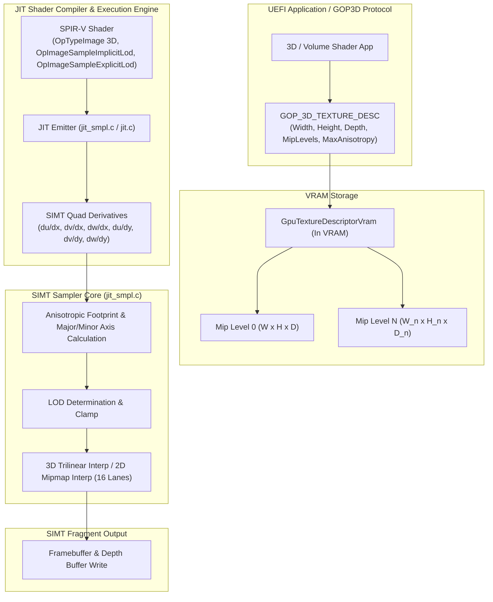
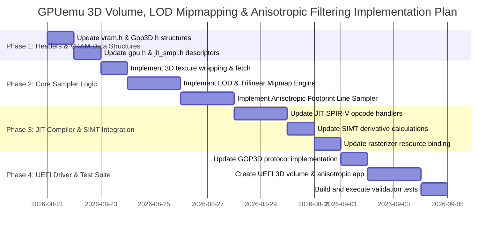

# Implementation Plan: 3D Volume Textures, LOD Mipmapping, and Anisotropic Filtering

This document details the complete, end-to-end technical implementation plan for adding **3D Volume Textures**, **LOD Mipmapping**, and **Anisotropic Filtering** to the GPUemu hardware emulator, JIT compiler, SIMT rasterizer, and UEFI `GOP_3D_PROTOCOL`.

---

## 1. Architectural Overview

The current GPUemu sampling architecture supports basic 2D textures with nearest and bilinear filtering using single-level textures. To achieve feature parity with modern 3D GPUs, the sampling pipeline will be extended as follows:



---

## 2. VRAM Descriptor & API Updates

### 2.1 Protocol Headers (`UEFI/OvmfPkg/Include/Protocol/Gop3D.h` & `include/vram.h`)

Extend the `GpuTextureDescriptorVram` structure to incorporate 3D dimensions, mipmap chain pointers, extended wrap modes, and anisotropic filtering configuration.

```c
// include/vram.h & UEFI/OvmfPkg/Include/Protocol/Gop3D.h

typedef enum {
    TEXTURE_DIM_2D = 0,
    TEXTURE_DIM_3D = 1,
    TEXTURE_DIM_CUBE = 2
} GpuTextureDimension;

typedef enum {
    FILTER_NEAREST                = 0,
    FILTER_LINEAR                 = 1,
    FILTER_NEAREST_MIPMAP_NEAREST = 2,
    FILTER_LINEAR_MIPMAP_NEAREST  = 3,
    FILTER_NEAREST_MIPMAP_LINEAR  = 4,
    FILTER_LINEAR_MIPMAP_LINEAR   = 5  // Trilinear filtering
} FilterMode;

typedef enum {
    WRAP_REPEAT = 0,
    WRAP_CLAMP  = 1,
    WRAP_MIRROR = 2
} WrapMode;

#define MAX_MIP_LEVELS 14

typedef struct __attribute__((packed)) {
    uint32_t data_vram_addr;          // VRAM offset of Mip level 0 pixel data
    uint32_t width;                   // Base width (Level 0)
    uint32_t height;                  // Base height (Level 0)
    uint32_t depth;                   // Base depth (Level 0, set to 1 for 2D)
    uint32_t channels;                // 1, 2, 3, 4
    uint32_t dimension;               // 0: 2D, 1: 3D (GpuTextureDimension)
    uint32_t filter;                  // FilterMode
    uint32_t wrap_u;                  // WrapMode for U/S
    uint32_t wrap_v;                  // WrapMode for V/T
    uint32_t wrap_w;                  // WrapMode for W/R (3D volume depth axis)
    uint32_t num_mip_levels;          // Number of mipmap levels present (1 = base level only)
    float    max_anisotropy;          // Max anisotropic ratio (1.0f = disabled, up to 16.0f)
    float    min_lod;                 // Minimum clamp for LOD (e.g. 0.0f)
    float    max_lod;                 // Maximum clamp for LOD (e.g. 13.0f)
    float    lod_bias;                // User LOD bias (added to computed LOD)
    uint32_t mip_offsets[MAX_MIP_LEVELS]; // VRAM relative offsets for Mip levels 0..13
} GpuTextureDescriptorVram;
```

---

## 3. GPU State & JIT Sampler Extensions

### 3.1 Host Sampler Descriptor (`gpu/jit/jit_smpl.h` & `gpu/gpu.h`)

Update the host internal `TextureSamplerDescriptor` structure to hold calculated host memory addresses for each mip level:

```c
typedef struct {
    void*      data;                            // Pointer to host mapped VRAM (Mip 0)
    void*      mip_data[MAX_MIP_LEVELS];        // Pointers to host mapped VRAM per mip level
    uint32_t   width;
    uint32_t   height;
    uint32_t   depth;                           // Depth dimension for 3D textures
    uint32_t   channels;
    uint32_t   dimension;                       // 0 = 2D, 1 = 3D
    FilterMode filter;
    WrapMode   wrap_u;
    WrapMode   wrap_v;
    WrapMode   wrap_w;
    uint32_t   num_mip_levels;
    float      max_anisotropy;
    float      min_lod;
    float      max_lod;
    float      lod_bias;
} TextureSamplerDescriptor;
```

### 3.2 Resource Binding (`gpu/rasterizer_simt.c`)

Update `bind_resources_to_context()` in `gpu/rasterizer_simt.c` to populate all fields and host pointers for `mip_data[lvl]`:

```c
for (int lvl = 0; lvl < vram_desc->num_mip_levels && lvl < MAX_MIP_LEVELS; lvl++) {
    uint32_t mip_vram = vram_desc->data_vram_addr + vram_desc->mip_offsets[lvl];
    gpu->textures[slot].mip_data[lvl] = (void *)(gpu->vram_ptr + mip_vram);
}
```

---

## 4. Mathematics & Sampling Algorithms (`gpu/jit/jit_smpl.c`)

### 4.1 3D Volume Texture Sampling & Coordinate Wrapping

Coordinate normalization and wrapping for 3D textures across all 3 axes $(u, v, w) \rightarrow (x, y, z)$:

$$u_{\text{norm}} = \text{wrap\_coordinate}(u, \text{wrap\_u})$$
$$v_{\text{norm}} = \text{wrap\_coordinate}(v, \text{wrap\_v})$$
$$w_{\text{norm}} = \text{wrap\_coordinate}(w, \text{wrap\_w})$$

For **Trilinear 3D Interpolation** at a given Mip level $(W, H, D)$:
$$u_{\text{tex}} = u_{\text{norm}} \cdot W - 0.5, \quad v_{\text{tex}} = v_{\text{norm}} \cdot H - 0.5, \quad w_{\text{tex}} = w_{\text{norm}} \cdot D - 0.5$$

$$x_0 = \lfloor u_{\text{tex}} \rfloor, \quad y_0 = \lfloor v_{\text{tex}} \rfloor, \quad z_0 = \lfloor w_{\text{tex}} \rfloor$$
$$x_1 = x_0 + 1, \quad y_1 = y_0 + 1, \quad z_1 = z_0 + 1$$

$$f_x = u_{\text{tex}} - x_0, \quad f_y = v_{\text{tex}} - y_0, \quad f_z = w_{\text{tex}} - z_0$$

Texel offset formula for 3D volume data:
$$\text{idx}(x, y, z) = \left( z \cdot H \cdot W + y \cdot W + x \right) \cdot \text{channels}$$

Perform 8-texel sample fetch $C_{xyz}$ and interpolate:
$$C_{00} = C_{000}(1 - f_x) + C_{100} f_x, \quad C_{10} = C_{010}(1 - f_x) + C_{110} f_x$$
$$C_{01} = C_{001}(1 - f_x) + C_{101} f_x, \quad C_{11} = C_{011}(1 - f_x) + C_{111} f_x$$

$$C_0 = C_{00}(1 - f_y) + C_{10} f_y, \quad C_1 = C_{01}(1 - f_y) + C_{11} f_y$$

$$C_{\text{final}} = C_0(1 - f_z) + C_1 f_z$$

---

### 4.2 Spatial Derivatives & Anisotropic Footprint Calculation

In SIMT mode, derivative vectors across the 2x2 pixel quad lanes are calculated in JIT code (`handle_op_image_sample_implicit_lod`):

$$\vec{J}_x = \left( \frac{\partial u}{\partial x} \cdot W, \frac{\partial v}{\partial x} \cdot H, \frac{\partial w}{\partial x} \cdot D \right)$$
$$\vec{J}_y = \left( \frac{\partial u}{\partial y} \cdot W, \frac{\partial v}{\partial y} \cdot H, \frac{\partial w}{\partial y} \cdot D \right)$$

#### Anisotropic Axis Lengths & Ratio

$$P_{x}^2 = \|\vec{J}_x\|^2 = \left(\frac{\partial u}{\partial x} W\right)^2 + \left(\frac{\partial v}{\partial x} H\right)^2 + \left(\frac{\partial w}{\partial x} D\right)^2$$
$$P_{y}^2 = \|\vec{J}_y\|^2 = \left(\frac{\partial u}{\partial y} W\right)^2 + \left(\frac{\partial v}{\partial y} H\right)^2 + \left(\frac{\partial w}{\partial y} D\right)^2$$
$$P_{xy} = \vec{J}_x \cdot \vec{J}_y$$

The eigenvalues of the screen-space ellipse tensor define the major axis $\lambda_{\max}$ and minor axis $\lambda_{\min}$:

$$A = P_x^2 + P_y^2, \quad B = P_x^2 - P_y^2, \quad C = 2 P_{xy}$$
$$\lambda_{\max} = \sqrt{\frac{1}{2} \left( A + \sqrt{B^2 + C^2} \right)}$$
$$\lambda_{\min} = \sqrt{\frac{1}{2} \left( A - \sqrt{B^2 + C^2} \right)}$$

#### Anisotropy Ratio & Mipmap Level Determination

$$\text{AnisoRatio} = \frac{\lambda_{\max}}{\max(\lambda_{\min}, 10^{-5})}$$
$$N = \text{clamp}\left( \lceil \text{AnisoRatio} \rceil, 1, \lfloor \text{desc->max\_anisotropy} \rfloor \right)$$

$$\text{LOD}_{\text{raw}} = \log_2\left( \frac{\lambda_{\max}}{N} \right) + \text{desc->lod\_bias}$$
$$\text{LOD} = \text{clamp}\left( \text{LOD}_{\text{raw}}, \text{desc->min\_lod}, \min(\text{desc->max\_lod}, \text{num\_mip\_levels} - 1) \right)$$

---

### 4.3 Anisotropic Line Sampling Engine

When $N > 1$, the sampler steps $N$ sample points along the direction of the major axis vector $\vec{d}_{\text{major}} = (du_{\text{maj}}, dv_{\text{maj}}, dw_{\text{maj}})$:

$$\vec{d}_{\text{major}} = \begin{cases} \left(\frac{\partial u}{\partial x}, \frac{\partial v}{\partial x}, \frac{\partial w}{\partial x}\right) & \text{if } P_x^2 \ge P_y^2 \\ \left(\frac{\partial u}{\partial y}, \frac{\partial v}{\partial y}, \frac{\partial w}{\partial y}\right) & \text{otherwise} \end{cases}$$

For step index $k \in [0, N-1]$:
$$t_k = \left( \frac{k + 0.5}{N} - 0.5 \right)$$
$$(u_k, v_k, w_k) = (u, v, w) + t_k \cdot \vec{d}_{\text{major}}$$

Accumulate samples across all $N$ steps at computed level $\text{LOD}$:

$$C_{\text{final}} = \frac{1}{N} \sum_{k=0}^{N-1} \text{SampleMipmapLevel}\left(u_k, v_k, w_k, \text{LOD}\right)$$

If `FILTER_LINEAR_MIPMAP_LINEAR` is configured, `SampleMipmapLevel` performs trilinear interpolation between level $D_0 = \lfloor \text{LOD} \rfloor$ and level $D_1 = D_0 + 1$ with blend weight $f = \text{LOD} - D_0$.

---

## 5. SPIR-V JIT Pipeline Extensions (`gpu/jit/jit_smpl.c` & `gpu/jit/jit.c`)

### 5.1 Updates to JIT Instruction Handlers

1. **`handle_op_type_image`**:
   - Store image dimension (`Dim` operand: 1 = 1D, 2 = 2D, 3 = 3D).
2. **`handle_op_image_sample_implicit_lod` & `handle_op_image_sample_explicit_lod`**:
   - Support 3-component coordinates $(u, v, w)$ for 3D textures.
   - Extract `w_coords` when `dim == 3`.
   - Pass spatial derivatives $(du/dx, dv/dx, dw/dx, du/dy, dv/dy, dw/dy)$ to SIMT sample function.
3. **C Function Binding (`sample_texture_generic_simt`)**:
   - Signature:
   ```c
   void sample_texture_generic_simt(
       const TextureSamplerDescriptor *desc,
       const float *u_coords,
       const float *v_coords,
       const float *w_coords,
       const float *du_dx, const float *dv_dx, const float *dw_dx,
       const float *du_dy, const float *dv_dy, const float *dw_dy,
       const float *explicit_lod,
       float *out_r, float *out_g, float *out_b, float *out_a
   );
   ```

---

## 6. UEFI Protocol Integration (`UEFI/OptionRom/gop3d.c`)

Update `GpuBindTexture()` and VRAM allocation helpers in `gop3d.c` to support the extended `GOP_3D_TEXTURE_DESC` payload:

1. **Mipmap Offset Calculation**:
   - Helper function `Gop3dCalculateMipMapOffsets()` calculates packed sizes for 2D $(W/2^k \times H/2^k)$ and 3D $(W/2^k \times H/2^k \times D/2^k)$ mip chains.
2. **Protocol Interface**:
   - Provide helper macro `CMD_SET_TEXTURE_EXT()` in `include/vram.h` for backward compatibility.

---

## 7. Step-by-Step Execution Plan



### Phase 1: Header Definitions & Descriptors
- Edit `include/vram.h`: Add `depth`, `dimension`, `wrap_w`, `num_mip_levels`, `max_anisotropy`, `min_lod`, `max_lod`, `lod_bias`, and `mip_offsets[]` to `GpuTextureDescriptorVram`.
- Edit `UEFI/OvmfPkg/Include/Protocol/Gop3D.h`: Mirror changes in `GOP_3D_TEXTURE_DESC`.
- Edit `gpu/jit/jit_smpl.h` and `gpu/gpu.h`: Update `TextureSamplerDescriptor`.

### Phase 2: Core SIMT Sampler Logic (`gpu/jit/jit_smpl.c`)
- Implement `sample_texel_3d_single()` for trilinear 3D voxel interpolation.
- Implement `compute_lod_and_aniso_footprint()` for derivative-based LOD and anisotropy ratio calculation.
- Implement `sample_mipmap_chain()` for trilinear mipmap interpolation.
- Update `sample_texture_generic_simt()` to execute anisotropic line sampling.

### Phase 3: JIT Compiler & Rasterizer
- Edit `gpu/jit/jit_smpl.c`: Extend `handle_op_image_sample_implicit_lod`, `handle_op_image_sample_explicit_lod`, and `handle_op_image_fetch` to extract 3D coordinates and pass derivatives.
- Edit `gpu/rasterizer_simt.c`: Update `bind_resources_to_context()` to resolve all `mip_data[]` host pointers.

### Phase 4: UEFI Driver & Verification
- Edit `UEFI/OptionRom/gop3d.c`: Add mipmap buffer allocation and binding support.
- Create `UEFI/SpirvApp/app_volume_3d.c` (or add test case in `UEFI/SpirvApp/app.c`) featuring a 3D volume texture sample and anisotropic mipmapped quad.
- Compile GPUemu with `make` or build system, launch test, verify zero regressions and precise sampling rendering output.

---

## 8. Verification & Acceptance Criteria

1. **3D Volume Textures**:
   - `sampler3D` shaders sample correctly along $(u, v, w)$ coordinates with smooth trilinear interpolation across depth slices.
2. **LOD Mipmapping**:
   - Minified textures automatically select appropriate mipmap levels based on screen-space UV derivatives.
   - Smooth transitions without aliasing artifacts when moving objects far from the camera.
3. **Anisotropic Filtering**:
   - Oblique angle surfaces retain sharp texture details up to $16\times$ anisotropy without blurring or moiré patterns.
4. **Build & Compatibility**:
   - Zero compilation warnings/errors across GPUemu, QEMU patch, and UEFI OVMF firmware.
