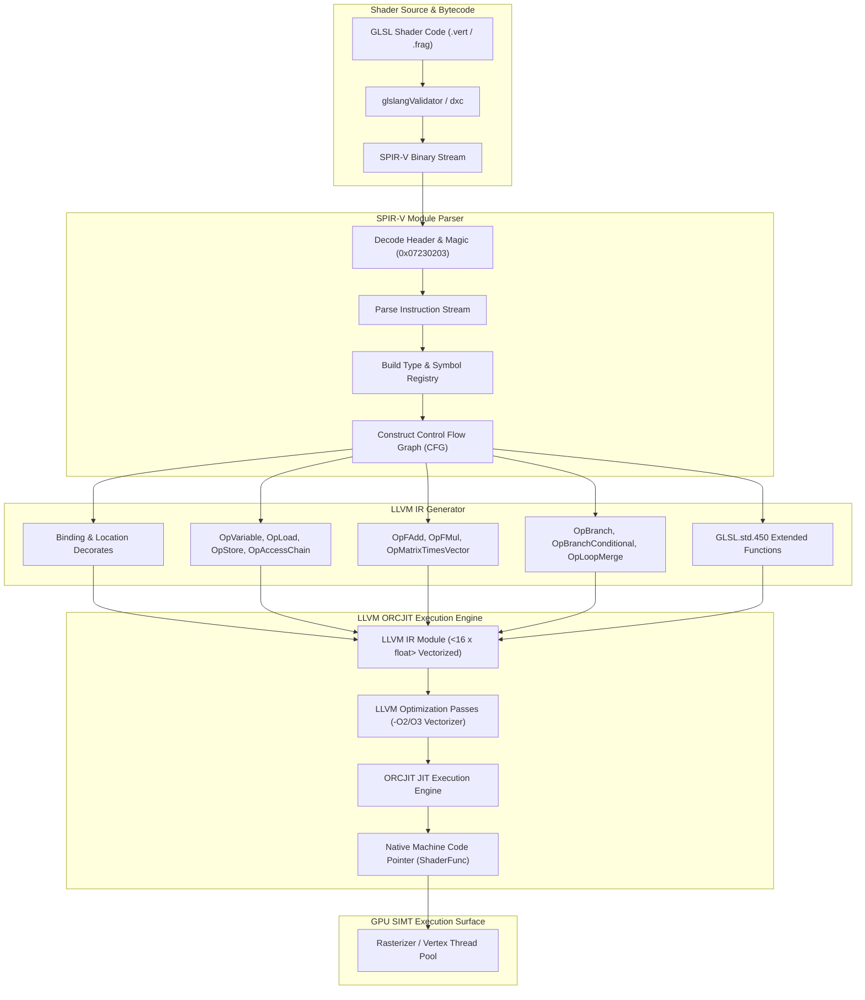
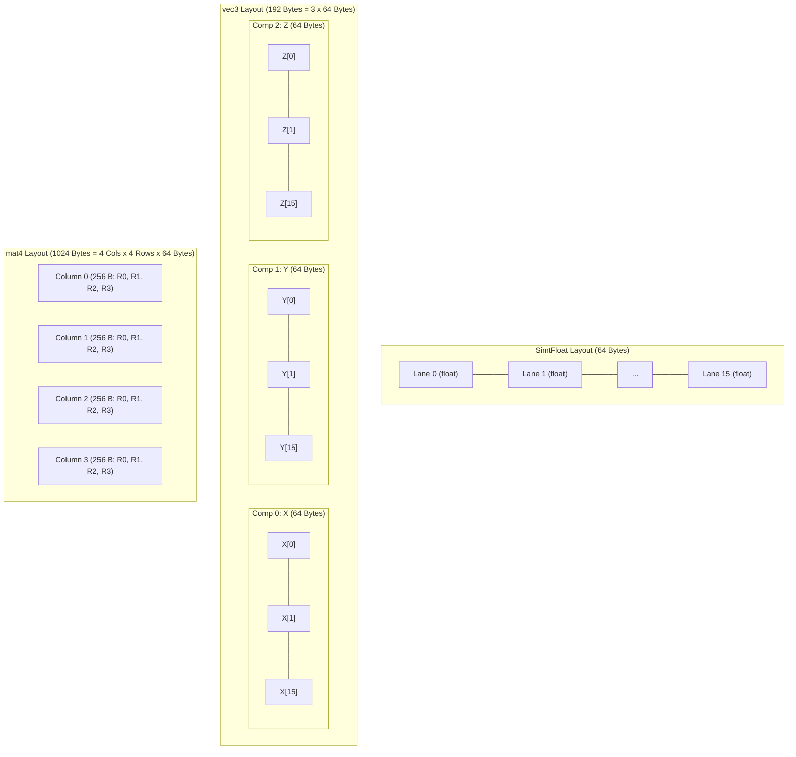
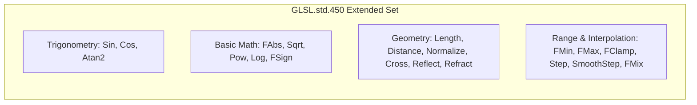
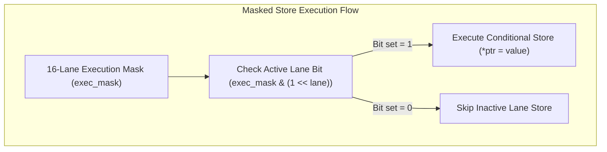

# Jitter (SPIR-V SIMT JIT Compiler) Architecture & Specification

The **Jitter** subsystem is an LLVM ORCJIT-based dynamic compiler that translates SPIR-V shader bytecode into native vectorized machine code. It uses a Single Instruction Multiple Threads (SIMT) execution model with a vector width of **16 parallel lanes** (`SIMT_WIDTH = 16`).

---

## 1. JIT Compilation Pipeline Architecture

---

## 2. SIMT Vector Memory Layouts & Data Representations

The JIT compiler processes work in **16-lane SIMT blocks**. Vector components are stored non-interleaved (component-wise arrays of 16 floats), guaranteeing 64-byte vector alignment for hardware SSE/AVX vectorization.

### Memory Layout Summary Table

| Type | LLVM IR Representation | C Structural Representation | Byte Size | Lane Values & Access Pattern |
| :--- | :--- | :--- | :--- | :--- |
| `float` | `<16 x float>` | `struct { float lane[16]; }` | 64 B | Uniform scalar value broadcasted across all 16 lanes |
| `vec2` | `[2 x <16 x float>]` | `struct { SimtFloat x, y; }` | 128 B | 2 component arrays $\times$ 16 floats per component |
| `vec3` | `[3 x <16 x float>]` | `struct { SimtFloat x, y, z; }` | 192 B | 3 component arrays $\times$ 16 floats per component |
| `vec4` | `[4 x <16 x float>]` | `struct { SimtFloat x, y, z, w; }` | 256 B | 4 component arrays $\times$ 16 floats per component |
| `mat2` | `[2 x [2 x <16 x float>]]` | `struct { vec2 col[2]; }` | 256 B | 2 column vectors $\times$ 2 rows $\times$ 16 lanes |
| `mat3` | `[3 x [3 x <16 x float>]]` | `struct { vec3 col[3]; }` | 576 B | 3 column vectors $\times$ 3 rows $\times$ 16 lanes |
| `mat4` | `[4 x [4 x <16 x float>]]` | `struct { vec4 col[4]; }` | 1024 B | 4 column vectors $\times$ 4 rows $\times$ 16 lanes |

---

## 3. Supported SPIR-V Instructions

| Opcode | Instruction Name | Description | Status |
| :--- | :--- | :--- | :--- |
| `3` | `OpSource` | Source language documentation | ✅ Supported |
| `5` | `OpName` | Debug variable naming | ✅ Supported |
| `6` | `OpMemberName` | Debug struct member naming | ✅ Supported |
| `11` | `OpExtInstImport` | Import extended instruction set (GLSL.std.450) | ✅ Supported |
| `12` | `OpExtInst` | Execute extended instruction | ✅ Supported |
| `14` | `OpMemoryModel` | Memory model specification | ✅ Supported |
| `15` | `OpEntryPoint` | Entry point declaration | ✅ Supported |
| `16` | `OpExecutionMode` | Shader execution mode setup | ✅ Supported |
| `17` | `OpCapability` | Capability declaration | ✅ Supported |
| `19` | `OpTypeVoid` | Void type definition | ✅ Supported |
| `20` | `OpTypeBool` | Boolean type definition | ✅ Supported |
| `21` | `OpTypeInt` | Integer type definition | ✅ Supported |
| `22` | `OpTypeFloat` | Floating point type definition | ✅ Supported |
| `23` | `OpTypeVector` | Vector type definition | ✅ Supported |
| `24` | `OpTypeMatrix` | Matrix type definition | ✅ Supported |
| `28` | `OpTypeArray` | Array type definition | ✅ Supported |
| `30` | `OpTypeStruct` | Struct type definition | ✅ Supported |
| `32` | `OpTypePointer` | Pointer type definition | ✅ Supported |
| `33` | `OpTypeFunction` | Function signature type definition | ✅ Supported |
| `43` | `OpConstant` | Scalar constant definition | ✅ Supported |
| `44` | `OpConstantComposite` | Composite constant construction | ✅ Supported |
| `54` | `OpFunction` | Function definition | ✅ Supported |
| `56` | `OpFunctionEnd` | Function end marker | ✅ Supported |
| `59` | `OpVariable` | Memory variable declaration | ✅ Supported |
| `61` | `OpLoad` | Load from variable/pointer | ✅ Supported |
| `62` | `OpStore` | Store to variable/pointer | ✅ Supported |
| `65` | `OpAccessChain` | Struct/array/vector pointer indexing | ✅ Supported |
| `71` | `OpDecorate` | Variable decorations (Binding, Location, BufferBlock) | ✅ Supported |
| `72` | `OpMemberDecorate` | Struct member decorations | ✅ Supported |
| `79` | `OpVectorShuffle` | Vector swizzling & permutation | ✅ Supported |
| `80` | `OpCompositeConstruct` | Composite construction from components | ✅ Supported |
| `81` | `OpCompositeExtract` | Component extraction from composite | ✅ Supported |
| `111` | `OpConvertSToF` | Signed integer to float conversion | ✅ Supported |
| `127` | `OpFNegate` | Floating point negation | ✅ Supported |
| `128` | `OpIAdd` | Integer addition | ✅ Supported |
| `129` | `OpFAdd` | Floating point addition | ✅ Supported |
| `130` | `OpISub` | Integer subtraction | ✅ Supported |
| `131` | `OpFSub` | Floating point subtraction | ✅ Supported |
| `133` | `OpFMul` | Floating point multiplication | ✅ Supported |
| `136` | `OpFDiv` | Floating point division | ✅ Supported |
| `141` | `OpFMod` | Floating point modulo | ✅ Supported |
| `142` | `OpVectorTimesScalar` | Vector-scalar multiplication | ✅ Supported |
| `145` | `OpMatrixTimesVector` | Matrix-vector multiplication | ✅ Supported |
| `148` | `OpDot` | Vector dot product | ✅ Supported |
| `169` | `OpSelect` | Conditional select | ✅ Supported |
| `177` | `OpSLessThan` | Signed integer less-than comparison | ✅ Supported |
| `184` | `OpFOrdLessThan` | Float ordered less-than comparison | ✅ Supported |
| `186` | `OpFOrdGreaterThan` | Float ordered greater-than comparison | ✅ Supported |
| `246` | `OpLoopMerge` | Loop merge control block annotation | ✅ Supported |
| `247` | `OpSelectionMerge` | Selection merge control block annotation | ✅ Supported |
| `248` | `OpLabel` | Control flow basic block label | ✅ Supported |
| `249` | `OpBranch` | Unconditional branch | ✅ Supported |
| `250` | `OpBranchConditional` | Conditional branch | ✅ Supported |
| `253` | `OpReturn` | Function return (void) | ✅ Supported |
| `254` | `OpReturnValue` | Function return with value | ✅ Supported |

---

## 4. Supported Extended GLSL 450 Instructions (`GLSL.std.450`)

All 20 required GLSL extended math functions are fully supported:

| GLSL Function ID | Function Name | Execution Mode | SIMT Behavior |
| :--- | :--- | :--- | :--- |
| `1` | `Round` / `FAbs` | Vectorized | Absolute value per lane |
| `4` | `FSign` | Vectorized | Signum (-1.0, 0.0, 1.0) per lane |
| `13` | `Sin` | Vectorized | Taylor series / LLVM intrinsic sine |
| `14` | `Cos` | Vectorized | Cosine evaluation across 16 lanes |
| `25` | `Atan2` | Vectorized | Arc tangent of $y/x$ |
| `26` | `Pow` | Vectorized | Base raised to exponent $x^y$ |
| `28` | `Log` | Vectorized | Natural logarithm $\ln(x)$ |
| `31` | `Sqrt` | Vectorized | Square root evaluation |
| `37` | `FMin` | Vectorized | Component-wise minimum |
| `40` | `FMax` | Vectorized | Component-wise maximum |
| `43` | `FClamp` | Vectorized | Clamping value to $[\text{minVal}, \text{maxVal}]$ |
| `46` | `FMix` | Vectorized | Linear interpolation $x \cdot (1 - a) + y \cdot a$ |
| `48` | `Step` | Vectorized | Step function ($x < \text{edge} ? 0.0 : 1.0$) |
| `49` | `SmoothStep` | Vectorized | Hermite interpolation between 0 and 1 |
| `66` | `Length` | Vectorized | Vector magnitude $\sqrt{v \cdot v}$ |
| `67` | `Distance` | Vectorized | Distance between points $\text{Length}(p_0 - p_1)$ |
| `69` | `Normalize` | Vectorized | Unit vector scaling $v / \text{Length}(v)$ |
| `71` | `Cross` | Vectorized | 3D Cross product $v_0 \times v_1$ |
| `72` | `Reflect` | Vectorized | Reflection vector $I - 2 \cdot (N \cdot I) \cdot N$ |
| `73` | `Refract` | Vectorized | Refraction vector following Snell's law |

---

## 5. Control Flow & Masked Store Execution Model

For conditional branches, control flow, and depth/stamp execution masks, memory writes operate under execution mask gating:
- Each lane computes independently with its own attribute data.
- Stores to VRAM and framebuffer registers verify the active lane mask before writing.
- SIMT vectors maintain 64-byte alignment throughout processing to maximize SIMD instruction generation (SSE4.2/AVX2) by LLVM.