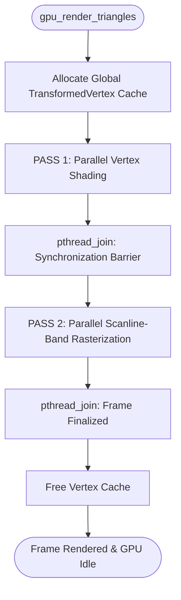
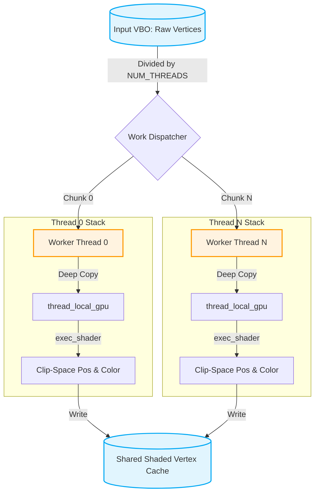
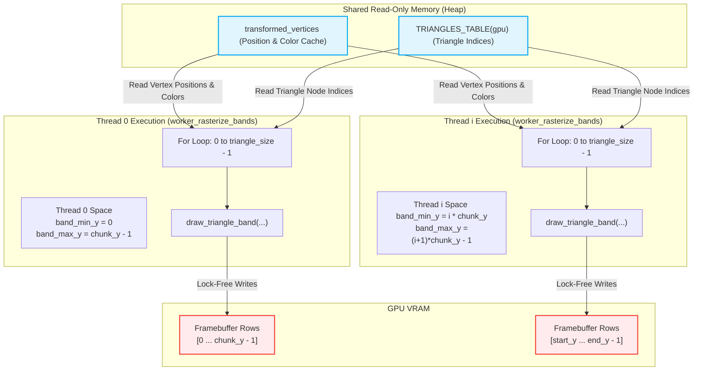

# Multithreaded Renderer Architecture

This document explains the high-performance, multithreaded architecture implemented in the renderer.c.

## High-Level Architecture Overview

The renderer transitions from a slow, single-threaded pipeline to a highly efficient Dual-Pass Parallel Architecture. It successfully solves the two classic bottlenecks of software rasterizers:

- Shader Register Clashing: Virtualized by creating isolated GpuState copies on each worker thread's local stack.

- Memory Overlap (Race Conditions): Handled by dividing the screen vertically into non-overlapping horizontal scanline bands (lock-free/atomic-free rasterization).

## PASS 1: Parallel Vertex Shading & Virtualization

This pass processes raw vertex data from `VERTEX_TABLE(gpu)`. By copying *(args->orig_gpu) to the thread's stack frame, each worker operates with isolated hardware registers during shader execution.

To avoid execution register corruption, each thread isolates its shader state. In addition, vertices are shaded exactly once instead of once per triangle, saving massive amounts of redundant vertex shader (`exec_shader`) execution.

### Thread Isolation and Memory Layout

### Process Details:

Every thread processes its allocated chunk of Vertices, writes input registers, runs exec_shader (the Vertex Shader), and caches the resultant Clip-Space Position and interpolated colors inside transformed_vertices.

## PASS 2: Lock-Free Horizontal Band Rasterization

This pass divides the framebuffer height dynamically among `NUM_RENDER_THREADS`. Because each thread strictly rasterizes a non-overlapping horizontal strip of screen coordinates, they read from the shared transformed_vertices array concurrently with zero thread contention or locking.

By partitioning the screen into horizontal bands, threads never touch the same pixel, completely eliminating the need for atomics.

### Process Details:

*The Workload*: Every thread is assigned a vertical screen range ($start\_y$ to $end\_y$).

*Broadcasting Triangles*: Every thread loops through the entire index table of triangles. However, inside draw_triangle_band(), we compute the triangle's bounding box and intersect it with the thread's horizontal band:

$$min\_y = \max(band\_min\_y, \min(y_0, y_1, y_2))$$

$$max\_y = \min(band\_max\_y, \max(y_0, y_1, y_2))$$

*Fast Culling*: If $min\_y > max\_y$, the triangle does not overlap the thread's screen portion, and is instantly skipped, costing practically zero CPU cycles.

*Zero-Lock Writing*: If a triangle falls into the thread's band, the thread loops through the pixels. Since Thread 0 only writes to rows 0...119 and Thread 1 only writes to rows 120...239, they can safely execute standard reads and writes to both the Framebuffer and Z-Buffer with zero synchronization overhead.
